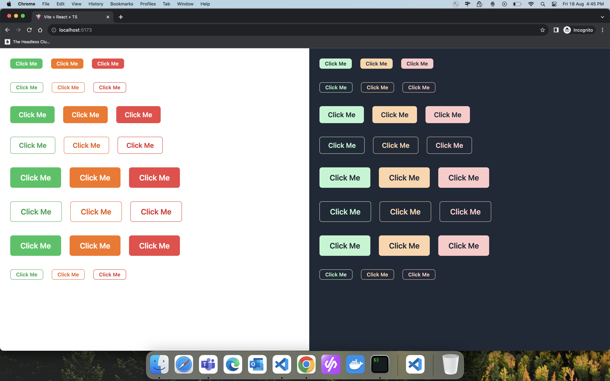
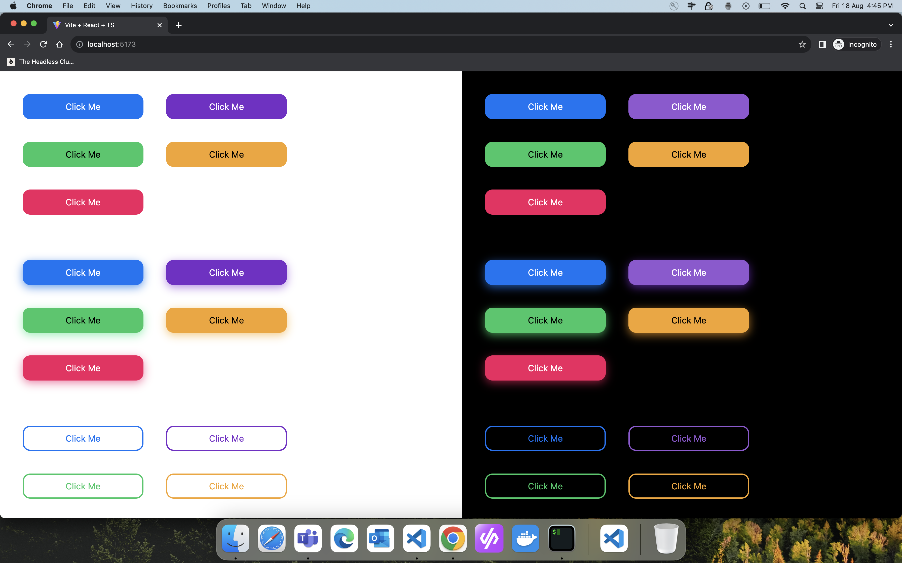
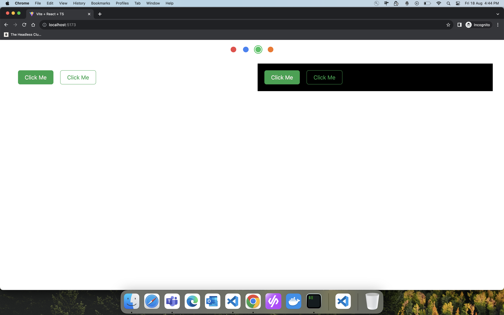

# Themable Design System with Tailwind CSS, React, and Tailwind Variants

Welcome to the Themable Design System repository! This project demonstrates the power of Tailwind CSS, React, and the amazing Tailwind Variants package in creating versatile and customizable components.

## Branches

### 1. Chakra Clone Button (Branch: chakra-ui)

In this branch, a button component inspired by Chakra UI has been created. The theme tokens from Chakra UI have been utilized, and theming is achieved using Tailwind CSS classes. For example, use `bg-red500` for light mode and `dark:bg-red500` for dark mode.

### 2. Next UI Button with Dual Themes (Branch: next-ui)

In the `next-ui` branch, the button component takes advantage of separate theme tokens for light and dark modes. By changing the theme class on the root component, colors are automatically applied, eliminating the need for the `dark:` selector.

### 3. Shad UI with Multiple Themes (Branch: shad-ui)

Drawing inspiration from Shad CDN, the `shad-ui` branch implements multiple themes, including green, orange, blue, and red. Experience a variety of visually appealing themes and explore the potential of Tailwind CSS & Tailwind Variants.

Feel free to explore these branches to see the different approaches to theming and design system creation. Happy coding!
